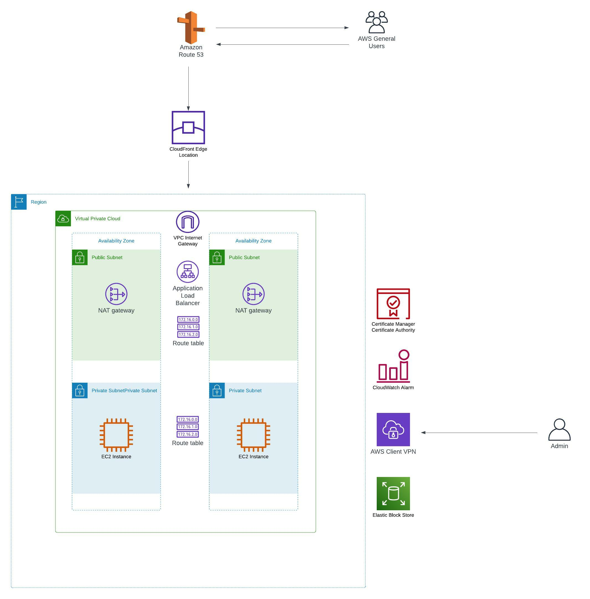

# A VPC + two EC2 instances + ACM + Cloudfront + Route53 + VPN + Amazon Linux

**Built with**

Terraform manages the deployment.

**Requirements**

1. AWS account
2. IAM user with admin privileges
3. Access and secret keys
4. AWS CLI
5. Terraform installed

**AWS resources created**

* 1 x VPC
* 2 x public subnets
* 2 x private subnets
* 2 x Route table
* 1 x Internet Gateway
* 2 x EC2
* 1 x SSH key
* 1 x VPN client
* 1 x SSL certificate
* 1 x CloudFront Distribution
* 1 x Route 53 Hosted Zone
* 1 X Route 53 A record
* 2 x EBS disk

**Getting started**

Deploy the code in your AWS account with Terraform

`terraform init`

`terraform validate`

`terraform plan`

`terraform apply`

`terraform destroy`


**Folder structure options and naming conventions for software projects**
```
.
|-- acm.tf                    # AWS Certificate Manager
|-- alb.tf                    # Application Load Balancer
|-- cdn.tf                    # CloudFront Distribution
|-- certificates              # Self-signed SSL certificates for the VPN authentication
|-- cloudwatch.tf             # Cloudwatch setting
|-- dns.tf                    # AWS Route 53 configuration
|-- ebs.tf                    # EBS disk settings
|-- main.tf                   # AWS provider's configuration
|-- networking.tf             # VPC, subnet and routing tables
|-- private-keys              # VPn authenticaton keys
|-- computing.tf              # Computing resources
|-- security_groups.tf        # Security groups
|-- ssh_keys.tf               # SSH keys
|-- variables.tf              # Variables
|-- scripts                   # EC2 initialization scripts
|-- vpn.tf                    # VPC Client VPN
|-- diagram.jpeg              # AWS network layout
|-- LICENSE.txt
|-- README.md
```

**Architecture**



**Contributing**

Contributions are what make the open-source community such an amazing place to learn, inspire, and create. Any contributions you make are greatly appreciated.

If you have a suggestion to improve this, please fork the repo and create a pull request. You can also open an issue with the tag "enhancement".

Don't forget to give the project a star! Thanks again!

**License**

It is distributed under the MIT License. See LICENSE.txt for more information.

**Contact**

Name: Eugenio Duarte

Email: eduarte@cloudacia.com
